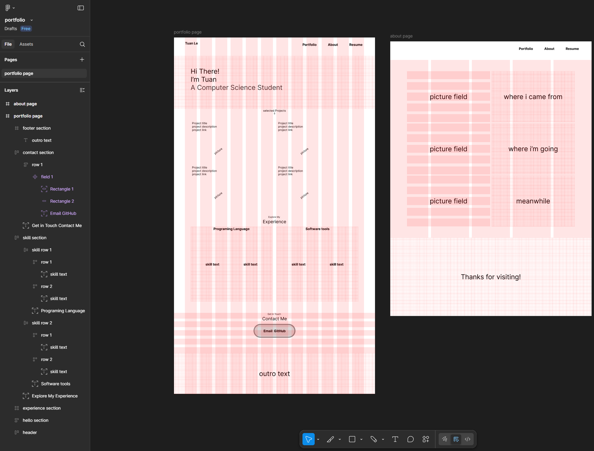

# My first portfolio website

**this project document my workflow of create my first portfolio website**

## TODOS

- [x] define a structure for the website
- [x] create a design for the website via figma
- [ ] implement design

---

## Step 1 - Design

- THINK, PLAN, RESEARCH

1. what does the user want?, how should the webside look like?
2. which tool can u use to create the design? (paper, figma, ...)

### THINK

- how should the website look like?
  1. portfolio page: with introduction, my skills and interesting project from university time
  2. about page: with information about me (where i came from, where i'm going, meanwhile what i'm doing)
  3. resume page: link to my resume

### PLAN

- get inspiration from other portfolio websites

- create a wireframe for each page
  - use figma to design the layout
  - focus on user experience and navigation

### RESEARCH

- inspiration:
  - https://webflow.com
    - https://www.laurenhungdesign.com/
    - https://akshayamad.webflow.io/
  - https://www.behance.net

### Result

## Step 2 - Coding

## eficient Design

1. repeadable design:

   - easy to reuse
   - break page into sechtions

2. hero section

   - first section that the user see

3. information sections

   - contain information about the product
   - get users attention => make simple easy to read, transparency here

4. explain feature and benefits

   - keep asking: what is the purpose of this section
   - look at the apple website for example: how ist the camera? is it fast? ...

5. colour and fonts
   - at least 4 colour (include black and white)
   - 1 fonts per website

---

## watch tutorial

- https://www.youtube.com/watch?v=BOt3MNB71gI&list=PLjiHFwhbHYlEmPhn68XdG2p2k4X47XR-8 (prototyping)
